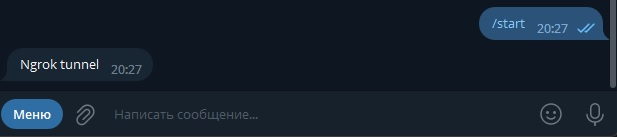
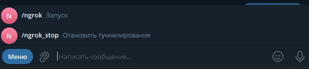
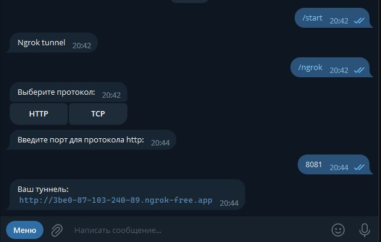
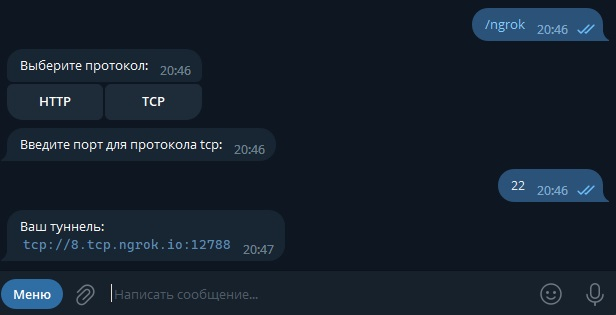

# Скрипт управления Ngrok через Telegram

1. Устанавливаем и настраиваем [ngrok](https://ngrok.com/download)
2. Устанавливаем недостающие библиотеки

        pip install telebot subprocess requests psutil

3. Идём в телеграм-бота [BotFather](https://t.me/BotFather), создаём бота и получаем токен.
4. Вставляем токен в строку:

        bot = telebot.TeleBot('ТОКЕН_ВАШЕГО_БОТА')
5. Имеется ограничение доступа по id пользователя:
    1. Идем в [этот](https://t.me/MissRose_bot) бот и пишем

            /id
    2. вставляем свой id в этой строке:

            allowed_users = [ВАШ_ID]
        
        Можно добавить несколько через запятую

6. Запускаем и проверяем

    

## Особенности бота
* Есть меню команд  

    
* Доступно на выбор TCP и HTTP/S

    

    